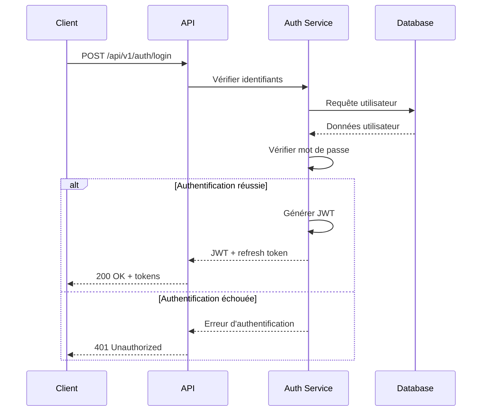
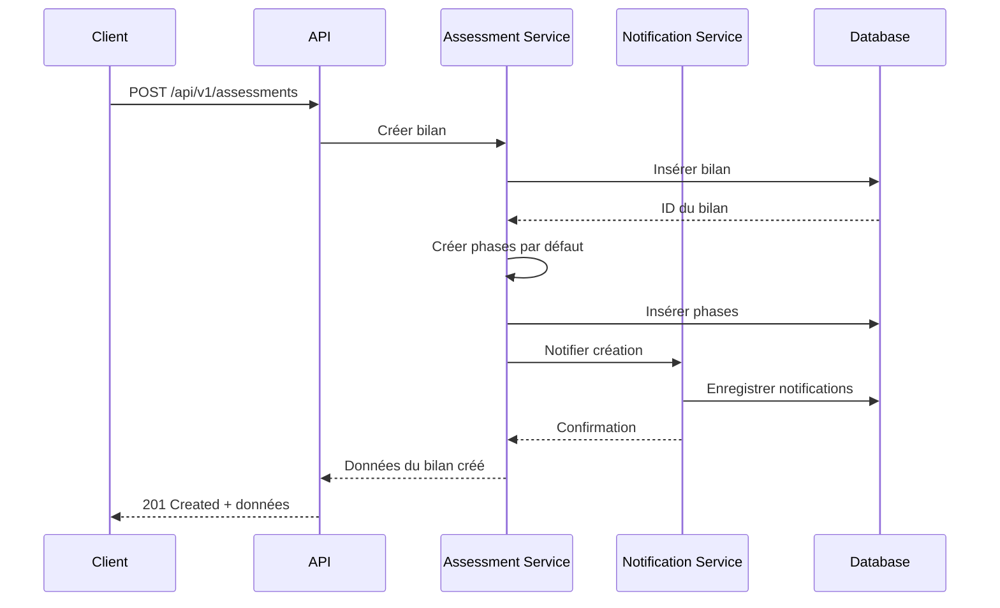
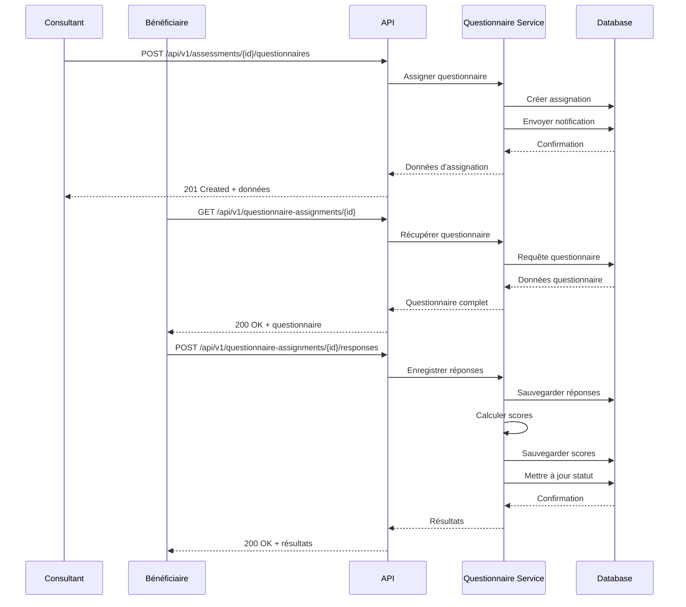

# API et flux de données

# Plateforme de gestion des bilans de compétences

## Introduction

Ce document définit l'architecture des API et les flux de données pour la plateforme de gestion des bilans de compétences. Il spécifie comment les différentes parties de l'application communiquent entre elles et avec des systèmes externes, en garantissant une expérience utilisateur fluide, des performances optimales et une sécurité robuste.

## Architecture générale des API

### Principes architecturaux

La plateforme adopte une architecture orientée services (SOA) avec une API RESTful comme couche d'interface principale. Cette approche offre plusieurs avantages :

1. **Séparation claire** entre le frontend et le backend
2. **Modularité** permettant des évolutions indépendantes
3. **Scalabilité** horizontale pour gérer la charge
4. **Réutilisabilité** des services pour différentes interfaces
5. **Testabilité** améliorée des composants individuels

### Structure des API

L'API est organisée selon les principes REST (Representational State Transfer) :

- Utilisation des méthodes HTTP standard (GET, POST, PUT, DELETE, PATCH)
- Ressources identifiées par des URLs significatives
- Représentation des ressources au format JSON
- Communication sans état (stateless)
- Utilisation des codes de statut HTTP appropriés

### Versionnement des API

Pour garantir la compatibilité et faciliter les évolutions :

- Versionnement dans l'URL : `/api/v1/resource`
- Support de plusieurs versions en parallèle pendant les transitions
- Documentation des changements entre versions
- Politique de dépréciation claire avec préavis

## Endpoints API principaux

### 1. Gestion des utilisateurs et authentification

#### Authentification

```
POST /api/v1/auth/login
POST /api/v1/auth/logout
POST /api/v1/auth/refresh-token
POST /api/v1/auth/forgot-password
POST /api/v1/auth/reset-password
POST /api/v1/auth/verify-2fa
```

#### Gestion des utilisateurs

```
GET    /api/v1/users
POST   /api/v1/users
GET    /api/v1/users/{id}
PUT    /api/v1/users/{id}
PATCH  /api/v1/users/{id}
DELETE /api/v1/users/{id}
GET    /api/v1/users/{id}/profile
PUT    /api/v1/users/{id}/profile
PATCH  /api/v1/users/{id}/profile
GET    /api/v1/users/{id}/permissions
PUT    /api/v1/users/{id}/permissions
```

#### Gestion des rôles et permissions

```
GET    /api/v1/roles
POST   /api/v1/roles
GET    /api/v1/roles/{id}
PUT    /api/v1/roles/{id}
DELETE /api/v1/roles/{id}
GET    /api/v1/permissions
GET    /api/v1/roles/{id}/permissions
PUT    /api/v1/roles/{id}/permissions
```

### 2. Gestion des bilans de compétences

#### Bilans

```
GET    /api/v1/assessments
POST   /api/v1/assessments
GET    /api/v1/assessments/{id}
PUT    /api/v1/assessments/{id}
PATCH  /api/v1/assessments/{id}
DELETE /api/v1/assessments/{id}
GET    /api/v1/assessments/{id}/status-history
POST   /api/v1/assessments/{id}/status
```

#### Phases et étapes

```
GET    /api/v1/assessments/{id}/phases
POST   /api/v1/assessments/{id}/phases
GET    /api/v1/phases/{id}
PUT    /api/v1/phases/{id}
DELETE /api/v1/phases/{id}
GET    /api/v1/phases/{id}/steps
POST   /api/v1/phases/{id}/steps
GET    /api/v1/steps/{id}
PUT    /api/v1/steps/{id}
DELETE /api/v1/steps/{id}
```

#### Notes

```
GET    /api/v1/assessments/{id}/notes
POST   /api/v1/assessments/{id}/notes
GET    /api/v1/notes/{id}
PUT    /api/v1/notes/{id}
DELETE /api/v1/notes/{id}
```

### 3. Gestion des rendez-vous

```
GET    /api/v1/appointments
POST   /api/v1/appointments
GET    /api/v1/appointments/{id}
PUT    /api/v1/appointments/{id}
PATCH  /api/v1/appointments/{id}
DELETE /api/v1/appointments/{id}
GET    /api/v1/appointments/{id}/summary
POST   /api/v1/appointments/{id}/summary
PUT    /api/v1/appointments/{id}/summary
```

#### Disponibilités

```
GET    /api/v1/consultants/{id}/availabilities
POST   /api/v1/consultants/{id}/availabilities
GET    /api/v1/availabilities/{id}
PUT    /api/v1/availabilities/{id}
DELETE /api/v1/availabilities/{id}
GET    /api/v1/consultants/{id}/available-slots
```

### 4. Questionnaires et tests

#### Questionnaires

```
GET    /api/v1/questionnaires
POST   /api/v1/questionnaires
GET    /api/v1/questionnaires/{id}
PUT    /api/v1/questionnaires/{id}
DELETE /api/v1/questionnaires/{id}
GET    /api/v1/questionnaires/{id}/sections
POST   /api/v1/questionnaires/{id}/sections
```

#### Questions et options

```
GET    /api/v1/sections/{id}/questions
POST   /api/v1/sections/{id}/questions
GET    /api/v1/questions/{id}
PUT    /api/v1/questions/{id}
DELETE /api/v1/questions/{id}
GET    /api/v1/questions/{id}/options
POST   /api/v1/questions/{id}/options
```

#### Assignation et réponses

```
GET    /api/v1/assessments/{id}/questionnaires
POST   /api/v1/assessments/{id}/questionnaires
GET    /api/v1/questionnaire-assignments/{id}
PUT    /api/v1/questionnaire-assignments/{id}
GET    /api/v1/questionnaire-assignments/{id}/responses
POST   /api/v1/questionnaire-assignments/{id}/responses
GET    /api/v1/responses/{id}
GET    /api/v1/responses/{id}/answers
POST   /api/v1/responses/{id}/answers
GET    /api/v1/responses/{id}/scores
```

### 5. Gestion documentaire

#### Modèles de documents

```
GET    /api/v1/document-templates
POST   /api/v1/document-templates
GET    /api/v1/document-templates/{id}
PUT    /api/v1/document-templates/{id}
DELETE /api/v1/document-templates/{id}
GET    /api/v1/document-templates/{id}/variables
POST   /api/v1/document-templates/{id}/variables
GET    /api/v1/document-templates/{id}/sections
POST   /api/v1/document-templates/{id}/sections
```

#### Documents

```
GET    /api/v1/assessments/{id}/documents
POST   /api/v1/assessments/{id}/documents
GET    /api/v1/documents/{id}
PUT    /api/v1/documents/{id}
DELETE /api/v1/documents/{id}
GET    /api/v1/documents/{id}/content
GET    /api/v1/documents/{id}/variables
PUT    /api/v1/documents/{id}/variables
```

#### Signatures

```
GET    /api/v1/documents/{id}/signatures
POST   /api/v1/documents/{id}/signatures
GET    /api/v1/signatures/{id}
PUT    /api/v1/signatures/{id}
GET    /api/v1/signatures/{id}/proof
```

#### Partage de documents

```
GET    /api/v1/documents/{id}/shares
POST   /api/v1/documents/{id}/shares
GET    /api/v1/shares/{id}
DELETE /api/v1/shares/{id}
GET    /api/v1/shared-documents/{token}
```

### 6. Communications

#### Messages

```
GET    /api/v1/messages
POST   /api/v1/messages
GET    /api/v1/messages/{id}
PUT    /api/v1/messages/{id}
DELETE /api/v1/messages/{id}
GET    /api/v1/messages/{id}/recipients
GET    /api/v1/messages/{id}/attachments
POST   /api/v1/messages/{id}/attachments
```

#### Notifications

```
GET    /api/v1/notifications
GET    /api/v1/notifications/{id}
PUT    /api/v1/notifications/{id}/read
GET    /api/v1/notification-templates
POST   /api/v1/notification-templates
GET    /api/v1/notification-templates/{id}
PUT    /api/v1/notification-templates/{id}
```

### 7. Facturation

#### Devis

```
GET    /api/v1/quotes
POST   /api/v1/quotes
GET    /api/v1/quotes/{id}
PUT    /api/v1/quotes/{id}
DELETE /api/v1/quotes/{id}
GET    /api/v1/quotes/{id}/items
POST   /api/v1/quotes/{id}/items
POST   /api/v1/quotes/{id}/convert-to-invoice
```

#### Factures

```
GET    /api/v1/invoices
POST   /api/v1/invoices
GET    /api/v1/invoices/{id}
PUT    /api/v1/invoices/{id}
DELETE /api/v1/invoices/{id}
GET    /api/v1/invoices/{id}/items
POST   /api/v1/invoices/{id}/items
GET    /api/v1/invoices/{id}/payments
POST   /api/v1/invoices/{id}/payments
```

#### Organismes financeurs

```
GET    /api/v1/funding-organizations
POST   /api/v1/funding-organizations
GET    /api/v1/funding-organizations/{id}
PUT    /api/v1/funding-organizations/{id}
DELETE /api/v1/funding-organizations/{id}
```

### 8. Reporting et statistiques

```
GET    /api/v1/reports/assessments
GET    /api/v1/reports/consultants
GET    /api/v1/reports/appointments
GET    /api/v1/reports/questionnaires
GET    /api/v1/reports/financial
GET    /api/v1/reports/custom
POST   /api/v1/reports/custom
```

### 9. Administration système

```
GET    /api/v1/system/status
GET    /api/v1/system/logs
GET    /api/v1/system/activity
GET    /api/v1/system/settings
PUT    /api/v1/system/settings
```

## Spécification détaillée des endpoints

### Exemple : Création d'un bilan de compétences

#### Requête

```
POST /api/v1/assessments
```

**Headers :**

```
Content-Type: application/json
Authorization: Bearer {jwt_token}
```

**Body :**

```json
{
  "beneficiary_id": "550e8400-e29b-41d4-a716-446655440000",
  "consultant_id": "550e8400-e29b-41d4-a716-446655440001",
  "start_date": "2025-05-01",
  "expected_end_date": "2025-08-15",
  "funding_type": "cpf",
  "funding_organization": "550e8400-e29b-41d4-a716-446655440002",
  "funding_amount": 1500.0,
  "total_hours": 24.0,
  "notes": "Bilan standard avec focus sur reconversion professionnelle"
}
```

#### Réponse

**Code :** 201 Created

**Body :**

```json
{
  "id": "550e8400-e29b-41d4-a716-446655440003",
  "beneficiary_id": "550e8400-e29b-41d4-a716-446655440000",
  "consultant_id": "550e8400-e29b-41d4-a716-446655440001",
  "status": "pending_start",
  "start_date": "2025-05-01",
  "expected_end_date": "2025-08-15",
  "actual_end_date": null,
  "follow_up_date": "2026-02-15",
  "funding_type": "cpf",
  "funding_organization": "550e8400-e29b-41d4-a716-446655440002",
  "funding_amount": 1500.0,
  "total_hours": 24.0,
  "completed_hours": 0.0,
  "progress_percentage": 0,
  "notes": "Bilan standard avec focus sur reconversion professionnelle",
  "created_at": "2025-04-15T14:30:00Z",
  "updated_at": "2025-04-15T14:30:00Z"
}
```

### Exemple : Récupération des rendez-vous d'un consultant

#### Requête

```
GET /api/v1/appointments?consultant_id=550e8400-e29b-41d4-a716-446655440001&start_date=2025-05-01&end_date=2025-05-31
```

**Headers :**

```
Authorization: Bearer {jwt_token}
```

#### Réponse

**Code :** 200 OK

**Body :**

```json
{
  "total": 5,
  "page": 1,
  "per_page": 20,
  "data": [
    {
      "id": "550e8400-e29b-41d4-a716-446655440010",
      "assessment_id": "550e8400-e29b-41d4-a716-446655440003",
      "consultant_id": "550e8400-e29b-41d4-a716-446655440001",
      "beneficiary_id": "550e8400-e29b-41d4-a716-446655440000",
      "title": "Entretien préliminaire",
      "description": "Premier entretien pour définir les objectifs du bilan",
      "appointment_type": "preliminary",
      "start_datetime": "2025-05-05T10:00:00Z",
      "end_datetime": "2025-05-05T12:00:00Z",
      "duration_minutes": 120,
      "location_type": "office",
      "location_details": "Bureau 302, 15 rue des Lilas",
      "status": "scheduled",
      "video_conference_link": null,
      "created_at": "2025-04-15T15:00:00Z",
      "updated_at": "2025-04-15T15:00:00Z"
    }
    // ... autres rendez-vous
  ]
}
```

## Format des données

### Conventions générales

- Utilisation du format JSON pour toutes les requêtes et réponses
- Dates au format ISO 8601 (YYYY-MM-DDTHH:MM:SSZ)
- Identifiants au format UUID
- Énumérations sous forme de chaînes de caractères
- Montants avec 2 décimales
- Pagination standard pour les listes

### Pagination

Les endpoints retournant des listes supportent la pagination avec les paramètres suivants :

- `page` : numéro de page (défaut : 1)
- `per_page` : nombre d'éléments par page (défaut : 20, max : 100)

Exemple de réponse paginée :

```json
{
  "total": 135,
  "page": 2,
  "per_page": 20,
  "total_pages": 7,
  "data": [
    // ... éléments de la page
  ]
}
```

### Filtrage et tri

Les endpoints supportent le filtrage et le tri avec les paramètres suivants :

- `filter[field]` : filtre sur un champ spécifique
- `sort` : champ de tri (préfixé par `-` pour ordre décroissant)

Exemple :

```
GET /api/v1/assessments?filter[status]=in_progress&sort=-created_at
```

## Flux de données

### 1. Flux d'authentification



### 2. Flux de création d'un bilan de compétences



### 3. Flux d'assignation et de complétion d'un questionnaire



### 4. Flux de génération et signature d'un document

```mermaid
sequenceDiagram
    participant Consultant
    participant Bénéficiaire
    participant API
    participant Document Service
    participant Signature Service
    participant Database

    Consultant->>API: POST /api/v1/assessments/{id}/documents
    API->>Document Service: Générer document
    Document Service->>Database: Récupérer modèle
    Database-->>Document Service: Modèle de document
    Document Service->>Database: Récupérer données bilan
    Database-->>Document Service: Données du bilan
    Document Service->>Document Service: Générer document
    Document Service->>Database: Sauvegarder document
    Database-->>Document Service: ID du document
    Document Service-->>API: Document généré
    API-->>Consultant: 201 Created + document

    Consultant->>API: POST /api/v1/documents/{id}/signatures
    API->>Signature Service: Initier signature
    Signature Service->>Database: Créer demande signature
    Signature Service->>Database: Envoyer notification
    Database-->>Signature Service: Confirmation
    Signature Service-->>API: Données signature
    API-->>Consultant: 201 Created + données

(Content truncated due to size limit. Use line ranges to read in chunks)
```
